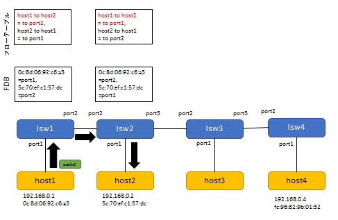

# 課題 (複数スイッチ対応版 ラーニングスイッチ) レポート

## 課題内容

複数スイッチに対応したラーニングスイッチ (multi_learning_switch.rb) の動作を説明しよう。

* 複数スイッチの FDB をどのように実現しているか、コードと動作を解説する
* 動作の様子やフローテーブルの内容もステップごとに確認すること
* 必要に応じて図解すること

## 複数スイッチの FDB の実現方法

MultiLearningSwitch は、起動時にハッシュテーブル @fdbs を作成する。その後、スイッチの起動を検知すると、 @fdbs に対して、そのスイッチの ID をキー、新規 FDB を値としたハッシュエントリを作成する。この新規 FDB はキーである ID のスイッチの FDB に対応するものであり、これによって、 @fdbs に対してスイッチの ID をキーとして指定すれば、そのスイッチの FDB にアクセスできるようになるであり、複数スイッチの FDB はこのようにして実現されている。

## MultiLearningSwitch の構成・動作

### 構成

まず、構成ファイル trema.multi.conf で定義されている、MultiLearningSwitch の構成を以下に図示する。


ホストの IP アドレスや MAC アドレス、及びスイッチのポート番号は、後述の動作確認の結果判明したものである。

続いて、MultiLearningSwitch の動作を解析するため、これに対して以下の操作を実行した。

* 動作１： host1 から host2 へパケットを送信する。
* 動作２： host2 から host1 へパケットを送信する。
* 動作３： host1 から host2 へ再びパケットを送信する。
* 動作４： host1 から host4 へパケットを送信する。
* 動作５： host4 から host1 へパケットを送信する。
* 動作６： host1 から host4 へ再びパケットを送信する。

各動作後に show_stats コマンドを実行してパケットが届いていることを確認し、 dump_flows コマンドで各スイッチのフローテーブルを表示する。

### 動作１と動作２

まず、動作１の実行結果を以下に掲載する。

```
ensyuu2@ubuntu:~/learning_switch$ ./bin/trema send_packets --source host1 --dest host2
ensyuu2@ubuntu:~/learning_switch$ ./bin/trema show_stats host2
Packets received:
  192.168.0.1 -> 192.168.0.2 = 1 packet
ensyuu2@ubuntu:~/learning_switch$ ./bin/trema dump_flows lsw1
NXST_FLOW reply (xid=0x4):
ensyuu2@ubuntu:~/learning_switch$ ./bin/trema dump_flows lsw2
NXST_FLOW reply (xid=0x4):
```

続いて、動作２の実行結果を以下に掲載する。

```
ensyuu2@ubuntu:~/learning_switch$ ./bin/trema send_packets --source host2 --dest host1
ensyuu2@ubuntu:~/learning_switch$ ./bin/trema show_stats host1
Packets sent:
  192.168.0.1 -> 192.168.0.2 = 1 packet
Packets received:
  192.168.0.2 -> 192.168.0.1 = 1 packet
ensyuu2@ubuntu:~/learning_switch$ ./bin/trema dump_flows lsw1
NXST_FLOW reply (xid=0x4):
 cookie=0x0, duration=13.976s, table=0, n_packets=0, n_bytes=0, idle_age=13, priority=65535,udp,in_port=2,vlan_tci=0x0000,dl_src=5c:70:ef:c1:57:dc,dl_dst=0c:8d:06:92:c6:a3,nw_src=192.168.0.2,nw_dst=192.168.0.1,nw_tos=0,tp_src=0,tp_dst=0 actions=output:1
ensyuu2@ubuntu:~/learning_switch$ ./bin/trema dump_flows lsw2
NXST_FLOW reply (xid=0x4):
 cookie=0x0, duration=19.824s, table=0, n_packets=0, n_bytes=0, idle_age=19, priority=65535,udp,in_port=1,vlan_tci=0x0000,dl_src=5c:70:ef:c1:57:dc,dl_dst=0c:8d:06:92:c6:a3,nw_src=192.168.0.2,nw_dst=192.168.0.1,nw_tos=0,tp_src=0,tp_dst=0 actions=output:2
```

動作２までの MultiLearningSwitch の挙動は、テキスト 7.3 節に記述されている通りである。

### 動作３

動作３の実行結果を以下に掲載する。

```
ensyuu2@ubuntu:~/learning_switch$ ./bin/trema send_packets --source host1 --dest host2
ensyuu2@ubuntu:~/learning_switch$ ./bin/trema show_stats host2
Packets sent:
  192.168.0.2 -> 192.168.0.1 = 1 packet
Packets received:
  192.168.0.1 -> 192.168.0.2 = 2 packets
ensyuu2@ubuntu:~/learning_switch$ ./bin/trema dump_flows lsw1
NXST_FLOW reply (xid=0x4):
 cookie=0x0, duration=45.695s, table=0, n_packets=0, n_bytes=0, idle_age=45, priority=65535,udp,in_port=2,vlan_tci=0x0000,dl_src=5c:70:ef:c1:57:dc,dl_dst=0c:8d:06:92:c6:a3,nw_src=192.168.0.2,nw_dst=192.168.0.1,nw_tos=0,tp_src=0,tp_dst=0 actions=output:1
 cookie=0x0, duration=8.646s, table=0, n_packets=0, n_bytes=0, idle_age=8, priority=65535,udp,in_port=1,vlan_tci=0x0000,dl_src=0c:8d:06:92:c6:a3,dl_dst=5c:70:ef:c1:57:dc,nw_src=192.168.0.1,nw_dst=192.168.0.2,nw_tos=0,tp_src=0,tp_dst=0 actions=output:2
ensyuu2@ubuntu:~/learning_switch$ ./bin/trema dump_flows lsw2
NXST_FLOW reply (xid=0x4):
 cookie=0x0, duration=50.65s, table=0, n_packets=0, n_bytes=0, idle_age=50, priority=65535,udp,in_port=1,vlan_tci=0x0000,dl_src=5c:70:ef:c1:57:dc,dl_dst=0c:8d:06:92:c6:a3,nw_src=192.168.0.2,nw_dst=192.168.0.1,nw_tos=0,tp_src=0,tp_dst=0 actions=output:2
 cookie=0x0, duration=13.582s, table=0, n_packets=0, n_bytes=0, idle_age=13, priority=65535,udp,in_port=2,vlan_tci=0x0000,dl_src=0c:8d:06:92:c6:a3,dl_dst=5c:70:ef:c1:57:dc,nw_src=192.168.0.1,nw_dst=192.168.0.2,nw_tos=0,tp_src=0,tp_dst=0 actions=output:1
```

次に、動作３実行後の各スイッチのフローテーブルと FDB を下図に示す。ここで、上部にある表がフローテーブルであり、下部にある表が FDB である。赤字のエントリは、当該動作の結果追加または更新されたエントリである。黒矢印は当該動作におけるパケットの流れを表している。

 
 
 動作３における MultiLearningSwitch の挙動を以下に列挙する。
 
 1. host1 から lsw1 へパケットが送信される。 対応するフローエントリがないので、lsw1 はこれを受けて Packet In を送信する。コントローラは、 FDB を検索して宛先の host2 が port2 で接続していることを知り、 port2 へ Packet Out すると共に Flow Mod を送信して "host1 to host2 = to port2" のエントリを追加する。
 2. パケットは lsw2 に到着、対応するフローエントリがないので、lsw1 はこれを受けて Packet In を送信する。コントローラは、 FDB を検索して宛先の host2 が port1 で接続していることを知り、 port1 へ Packet Out すると共に Flow Mod を送信して "host1 to host2 = to port1" のエントリを追加する。

### 動作４

動作４の実行結果を以下に掲載する。


