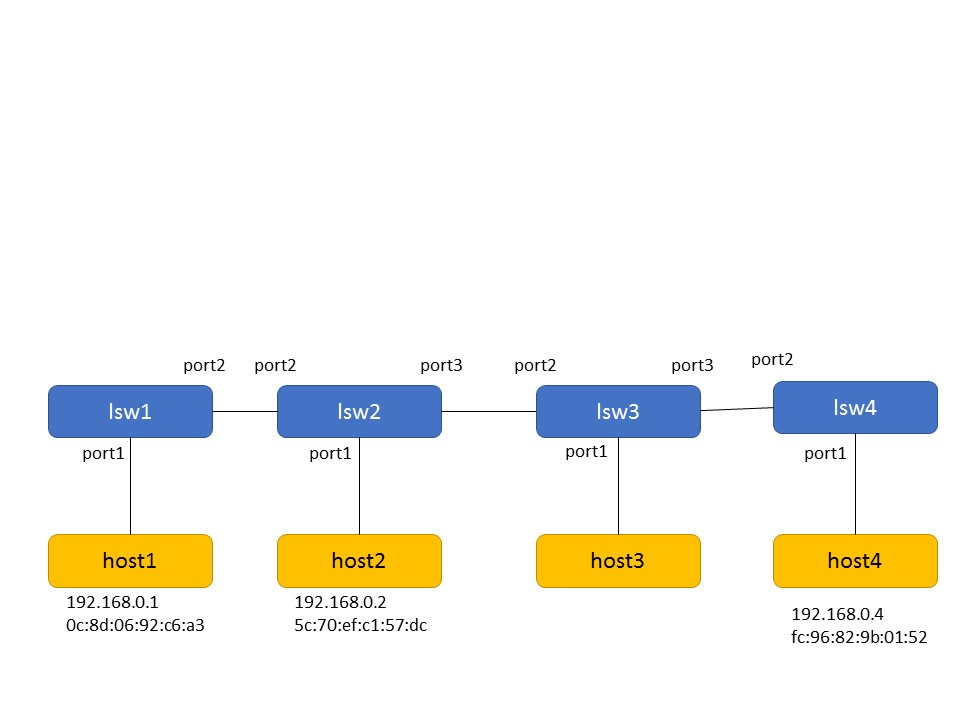
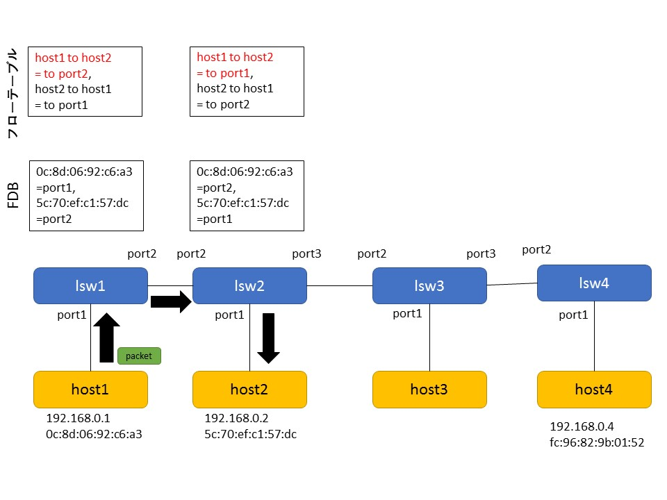
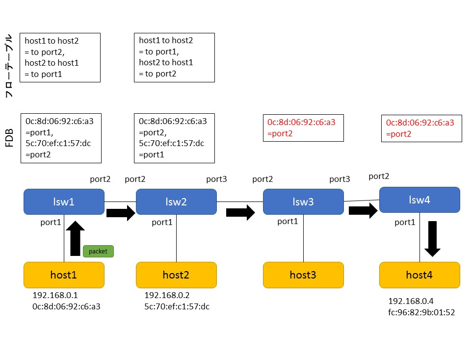
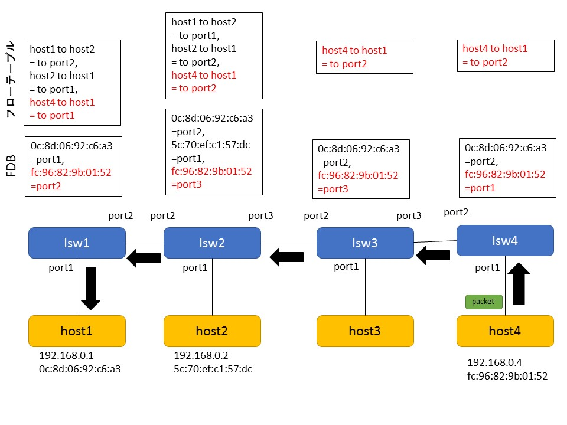
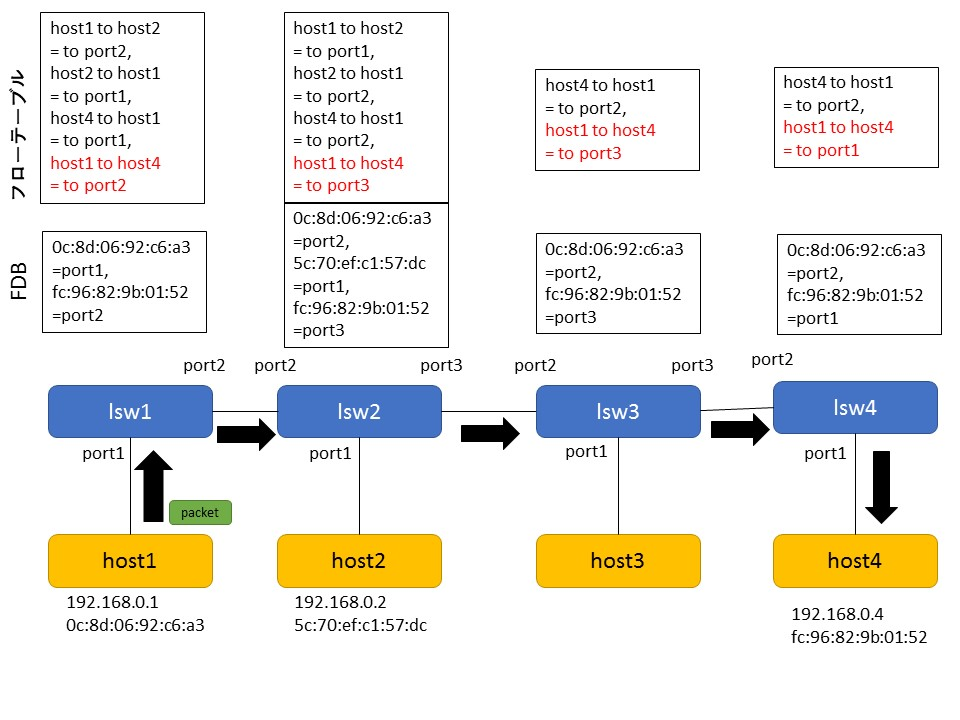

# 課題 (複数スイッチ対応版 ラーニングスイッチ) レポート

## 課題内容

複数スイッチに対応したラーニングスイッチ (multi_learning_switch.rb) の動作を説明しよう。

* 複数スイッチの FDB をどのように実現しているか、コードと動作を解説する
* 動作の様子やフローテーブルの内容もステップごとに確認すること
* 必要に応じて図解すること

## 複数スイッチの FDB の実現方法

MultiLearningSwitch は、起動時にハッシュテーブル @fdbs を作成する。その後、スイッチの起動を検知すると、 @fdbs に対して、そのスイッチの ID をキー、新規 FDB を値としたハッシュエントリを作成する。この新規 FDB はキーである ID のスイッチの FDB に対応するものであり、これによって、 @fdbs に対してスイッチの ID をキーとして指定すれば、そのスイッチの FDB にアクセスできるようになるであり、複数スイッチの FDB はこのようにして実現されている。

## MultiLearningSwitch の構成・動作

### 構成

まず、構成ファイル trema.multi.conf で定義されている、MultiLearningSwitch の構成を以下に図示する。



ホストの IP アドレスや MAC アドレス、及びスイッチのポート番号は、後述の動作確認の結果判明したものである。

続いて、MultiLearningSwitch の動作を解析するため、これに対して以下の操作を実行した。

* 動作１： host1 から host2 へパケットを送信する。
* 動作２： host2 から host1 へパケットを送信する。
* 動作３： host1 から host2 へ再びパケットを送信する。
* 動作４： host1 から host4 へパケットを送信する。
* 動作５： host4 から host1 へパケットを送信する。
* 動作６： host1 から host4 へ再びパケットを送信する。

各動作後に show_stats コマンドを実行してパケットが届いていることを確認し、 dump_flows コマンドで各スイッチのフローテーブルを表示する。

### 動作１と動作２

まず、動作１の実行結果を以下に掲載する。

```
ensyuu2@ubuntu:~/learning_switch$ ./bin/trema send_packets --source host1 --dest host2
ensyuu2@ubuntu:~/learning_switch$ ./bin/trema show_stats host2
Packets received:
  192.168.0.1 -> 192.168.0.2 = 1 packet
ensyuu2@ubuntu:~/learning_switch$ ./bin/trema dump_flows lsw1
NXST_FLOW reply (xid=0x4):
ensyuu2@ubuntu:~/learning_switch$ ./bin/trema dump_flows lsw2
NXST_FLOW reply (xid=0x4):
```

続いて、動作２の実行結果を以下に掲載する。

```
ensyuu2@ubuntu:~/learning_switch$ ./bin/trema send_packets --source host2 --dest host1
ensyuu2@ubuntu:~/learning_switch$ ./bin/trema show_stats host1
Packets sent:
  192.168.0.1 -> 192.168.0.2 = 1 packet
Packets received:
  192.168.0.2 -> 192.168.0.1 = 1 packet
ensyuu2@ubuntu:~/learning_switch$ ./bin/trema dump_flows lsw1
NXST_FLOW reply (xid=0x4):
 cookie=0x0, duration=13.976s, table=0, n_packets=0, n_bytes=0, idle_age=13, priority=65535,udp,in_port=2,vlan_tci=0x0000,dl_src=5c:70:ef:c1:57:dc,dl_dst=0c:8d:06:92:c6:a3,nw_src=192.168.0.2,nw_dst=192.168.0.1,nw_tos=0,tp_src=0,tp_dst=0 actions=output:1
ensyuu2@ubuntu:~/learning_switch$ ./bin/trema dump_flows lsw2
NXST_FLOW reply (xid=0x4):
 cookie=0x0, duration=19.824s, table=0, n_packets=0, n_bytes=0, idle_age=19, priority=65535,udp,in_port=1,vlan_tci=0x0000,dl_src=5c:70:ef:c1:57:dc,dl_dst=0c:8d:06:92:c6:a3,nw_src=192.168.0.2,nw_dst=192.168.0.1,nw_tos=0,tp_src=0,tp_dst=0 actions=output:2
```

動作２までの MultiLearningSwitch の挙動は、テキスト 7.3 節に記述されている通りである。

### 動作３

動作３の実行結果を以下に掲載する。

```
ensyuu2@ubuntu:~/learning_switch$ ./bin/trema send_packets --source host1 --dest host2
ensyuu2@ubuntu:~/learning_switch$ ./bin/trema show_stats host2
Packets sent:
  192.168.0.2 -> 192.168.0.1 = 1 packet
Packets received:
  192.168.0.1 -> 192.168.0.2 = 2 packets
ensyuu2@ubuntu:~/learning_switch$ ./bin/trema dump_flows lsw1
NXST_FLOW reply (xid=0x4):
 cookie=0x0, duration=45.695s, table=0, n_packets=0, n_bytes=0, idle_age=45, priority=65535,udp,in_port=2,vlan_tci=0x0000,dl_src=5c:70:ef:c1:57:dc,dl_dst=0c:8d:06:92:c6:a3,nw_src=192.168.0.2,nw_dst=192.168.0.1,nw_tos=0,tp_src=0,tp_dst=0 actions=output:1
 cookie=0x0, duration=8.646s, table=0, n_packets=0, n_bytes=0, idle_age=8, priority=65535,udp,in_port=1,vlan_tci=0x0000,dl_src=0c:8d:06:92:c6:a3,dl_dst=5c:70:ef:c1:57:dc,nw_src=192.168.0.1,nw_dst=192.168.0.2,nw_tos=0,tp_src=0,tp_dst=0 actions=output:2
ensyuu2@ubuntu:~/learning_switch$ ./bin/trema dump_flows lsw2
NXST_FLOW reply (xid=0x4):
 cookie=0x0, duration=50.65s, table=0, n_packets=0, n_bytes=0, idle_age=50, priority=65535,udp,in_port=1,vlan_tci=0x0000,dl_src=5c:70:ef:c1:57:dc,dl_dst=0c:8d:06:92:c6:a3,nw_src=192.168.0.2,nw_dst=192.168.0.1,nw_tos=0,tp_src=0,tp_dst=0 actions=output:2
 cookie=0x0, duration=13.582s, table=0, n_packets=0, n_bytes=0, idle_age=13, priority=65535,udp,in_port=2,vlan_tci=0x0000,dl_src=0c:8d:06:92:c6:a3,dl_dst=5c:70:ef:c1:57:dc,nw_src=192.168.0.1,nw_dst=192.168.0.2,nw_tos=0,tp_src=0,tp_dst=0 actions=output:1
```

次に、動作３実行後の各スイッチのフローテーブルと FDB を下図に示す。ここで、上部にある表がフローテーブルであり、下部にある表が FDB である。赤字のエントリは、当該動作の結果追加または更新されたエントリである。黒矢印は当該動作におけるパケットの流れを表している。

 
 
 動作３における MultiLearningSwitch の挙動を以下に列挙する。
 
 1. host1 から lsw1 へパケットが送信される。 対応するフローエントリがないので、lsw1 はこれを受けて Packet In を送信する。コントローラは、 FDB を検索して宛先の host2 が port2 で接続していることを知り、 port2 へ Packet Out すると共に Flow Mod を送信して "host1 to host2 = to port2" のエントリを追加する。
 2. パケットは lsw2 に到着、対応するフローエントリがないので、lsw1 はこれを受けて Packet In を送信する。コントローラは、 FDB を検索して宛先の host2 が port1 で接続していることを知り、 port1 へ Packet Out すると共に Flow Mod を送信して "host1 to host2 = to port1" のエントリを追加する。

### 動作４

動作４の実行結果を以下に掲載する。

```
ensyuu2@ubuntu:~/learning_switch$ ./bin/trema send_packets --source host1 --dest host4
ensyuu2@ubuntu:~/learning_switch$ ./bin/trema show_stats host4
Packets received:
  192.168.0.1 -> 192.168.0.4 = 1 packet
ensyuu2@ubuntu:~/learning_switch$ ./bin/trema dump_flows lsw1
NXST_FLOW reply (xid=0x4):
 cookie=0x0, duration=162.37s, table=0, n_packets=0, n_bytes=0, idle_age=162, priority=65535,udp,in_port=2,vlan_tci=0x0000,dl_src=5c:70:ef:c1:57:dc,dl_dst=0c:8d:06:92:c6:a3,nw_src=192.168.0.2,nw_dst=192.168.0.1,nw_tos=0,tp_src=0,tp_dst=0 actions=output:1
 cookie=0x0, duration=125.321s, table=0, n_packets=0, n_bytes=0, idle_age=125, priority=65535,udp,in_port=1,vlan_tci=0x0000,dl_src=0c:8d:06:92:c6:a3,dl_dst=5c:70:ef:c1:57:dc,nw_src=192.168.0.1,nw_dst=192.168.0.2,nw_tos=0,tp_src=0,tp_dst=0 actions=output:2
ensyuu2@ubuntu:~/learning_switch$ ./bin/trema dump_flows lsw2
NXST_FLOW reply (xid=0x4):
 cookie=0x0, duration=164.453s, table=0, n_packets=0, n_bytes=0, idle_age=164, priority=65535,udp,in_port=1,vlan_tci=0x0000,dl_src=5c:70:ef:c1:57:dc,dl_dst=0c:8d:06:92:c6:a3,nw_src=192.168.0.2,nw_dst=192.168.0.1,nw_tos=0,tp_src=0,tp_dst=0 actions=output:2
 cookie=0x0, duration=127.385s, table=0, n_packets=0, n_bytes=0, idle_age=127, priority=65535,udp,in_port=2,vlan_tci=0x0000,dl_src=0c:8d:06:92:c6:a3,dl_dst=5c:70:ef:c1:57:dc,nw_src=192.168.0.1,nw_dst=192.168.0.2,nw_tos=0,tp_src=0,tp_dst=0 actions=output:1
ensyuu2@ubuntu:~/learning_switch$ ./bin/trema dump_flows lsw3
NXST_FLOW reply (xid=0x4):
ensyuu2@ubuntu:~/learning_switch$ ./bin/trema dump_flows lsw4
NXST_FLOW reply (xid=0x4):
```

次に、動作４実行後の各スイッチのフローテーブルと FDB を下図に示す。

 
 
 動作４における MultiLearningSwitch の挙動を以下に列挙する。
 
 1. host1 から lsw1 の port1 へパケットが送信される。 対応するフローエントリがないので、lsw1 はこれを受けて Packet In を送信する。コントローラは lsw1 の FDB を検索するが、host4 に対応するエントリがないので、パケットをフラッディングする。結果、port2 からパケットが送出される。
 2. lsw2 の port2 へパケットが到着。 対応するフローエントリがないので、lsw2 はこれを受けて Packet In を送信する。コントローラは lsw2 の FDB を検索するが、host4 に対応するエントリがないので、パケットをフラッディングする。結果、port1 と port3 からパケットが送出される。
 3. lsw3 の port2 へパケットが到着。 対応するフローエントリがないので、lsw3 はこれを受けて Packet In を送信する。コントローラは lsw3 の FDB を検索するが、host4 に対応するエントリがないので、パケットをフラッディングする。結果、port1 と port3 からパケットが送出される。また、port2 と host1 の対応が lsw3 の FDB に登録される。
 4. lsw4 の port2 へパケットが到着。 対応するフローエントリがないので、lsw4 はこれを受けて Packet In を送信する。コントローラは lsw4 の FDB を検索するが、host4 に対応するエントリがないので、パケットをフラッディングする。結果、port2 からパケットが送出され、 host4 へパケットが到着する。 また、port2 と host1 の対応が lsw4 の FDB に登録される。
 
### 動作５

動作５の実行結果を以下に掲載する。

```
ensyuu2@ubuntu:~/learning_switch$ ./bin/trema send_packets --source host4 --dest host1
ensyuu2@ubuntu:~/learning_switch$ ./bin/trema show_stats host1
Packets sent:
  192.168.0.1 -> 192.168.0.2 = 2 packets
  192.168.0.1 -> 192.168.0.4 = 1 packet
Packets received:
  192.168.0.2 -> 192.168.0.1 = 1 packet
  192.168.0.4 -> 192.168.0.1 = 1 packet
ensyuu2@ubuntu:~/learning_switch$ ./bin/trema dump_flows lsw1
NXST_FLOW reply (xid=0x4):
 cookie=0x0, duration=13.733s, table=0, n_packets=0, n_bytes=0, idle_age=13, priority=65535,udp,in_port=2,vlan_tci=0x0000,dl_src=fc:96:82:9b:01:52,dl_dst=0c:8d:06:92:c6:a3,nw_src=192.168.0.4,nw_dst=192.168.0.1,nw_tos=0,tp_src=0,tp_dst=0 actions=output:1
 cookie=0x0, duration=199.378s, table=0, n_packets=0, n_bytes=0, idle_age=199, priority=65535,udp,in_port=2,vlan_tci=0x0000,dl_src=5c:70:ef:c1:57:dc,dl_dst=0c:8d:06:92:c6:a3,nw_src=192.168.0.2,nw_dst=192.168.0.1,nw_tos=0,tp_src=0,tp_dst=0 actions=output:1
 cookie=0x0, duration=162.329s, table=0, n_packets=0, n_bytes=0, idle_age=162, priority=65535,udp,in_port=1,vlan_tci=0x0000,dl_src=0c:8d:06:92:c6:a3,dl_dst=5c:70:ef:c1:57:dc,nw_src=192.168.0.1,nw_dst=192.168.0.2,nw_tos=0,tp_src=0,tp_dst=0 actions=output:2
ensyuu2@ubuntu:~/learning_switch$ ./bin/trema dump_flows lsw2
NXST_FLOW reply (xid=0x4):
 cookie=0x0, duration=17.184s, table=0, n_packets=0, n_bytes=0, idle_age=17, priority=65535,udp,in_port=3,vlan_tci=0x0000,dl_src=fc:96:82:9b:01:52,dl_dst=0c:8d:06:92:c6:a3,nw_src=192.168.0.4,nw_dst=192.168.0.1,nw_tos=0,tp_src=0,tp_dst=0 actions=output:2
 cookie=0x0, duration=202.829s, table=0, n_packets=0, n_bytes=0, idle_age=202, priority=65535,udp,in_port=1,vlan_tci=0x0000,dl_src=5c:70:ef:c1:57:dc,dl_dst=0c:8d:06:92:c6:a3,nw_src=192.168.0.2,nw_dst=192.168.0.1,nw_tos=0,tp_src=0,tp_dst=0 actions=output:2
 cookie=0x0, duration=165.761s, table=0, n_packets=0, n_bytes=0, idle_age=165, priority=65535,udp,in_port=2,vlan_tci=0x0000,dl_src=0c:8d:06:92:c6:a3,dl_dst=5c:70:ef:c1:57:dc,nw_src=192.168.0.1,nw_dst=192.168.0.2,nw_tos=0,tp_src=0,tp_dst=0 actions=output:1
ensyuu2@ubuntu:~/learning_switch$ ./bin/trema dump_flows lsw3
NXST_FLOW reply (xid=0x4):
 cookie=0x0, duration=20.751s, table=0, n_packets=0, n_bytes=0, idle_age=20, priority=65535,udp,in_port=3,vlan_tci=0x0000,dl_src=fc:96:82:9b:01:52,dl_dst=0c:8d:06:92:c6:a3,nw_src=192.168.0.4,nw_dst=192.168.0.1,nw_tos=0,tp_src=0,tp_dst=0 actions=output:2
ensyuu2@ubuntu:~/learning_switch$ ./bin/trema dump_flows lsw4
NXST_FLOW reply (xid=0x4):
 cookie=0x0, duration=23.925s, table=0, n_packets=0, n_bytes=0, idle_age=23, priority=65535,udp,in_port=1,vlan_tci=0x0000,dl_src=fc:96:82:9b:01:52,dl_dst=0c:8d:06:92:c6:a3,nw_src=192.168.0.4,nw_dst=192.168.0.1,nw_tos=0,tp_src=0,tp_dst=0 actions=output:2
```

次に、動作５実行後の各スイッチのフローテーブルと FDB を下図に示す。

 
 
 動作５における MultiLearningSwitch の挙動を以下に列挙する。
 
 1. host4 から lsw4 の port1 へパケットが送信される。 対応するフローエントリがないので、lsw4 はこれを受けて Packet In を送信する。コントローラは lsw4 の FDB を検索し、 host1 に対応するポート port2 を発見する。そしてパケットを port2 へ Packet Out すると共に Flow Mod を送信して 、"host4 to host1 = to port2" のエントリを追加する。また、port1 と host4 の対応が lsw4 の FDB に登録される。
 2. lsw3 の port3 へパケットが到着。 対応するフローエントリがないので、lsw3 はこれを受けて Packet In を送信する。コントローラは lsw3 の FDB を検索し、 host1 に対応するポート port2 を発見する。そしてパケットを port2 へ Packet Out すると共に Flow Mod を送信して 、"host4 to host1 = to port2" のエントリを追加する。また、port3 と host4 の対応が lsw3 の FDB に登録される。
 3. lsw2 の port3 へパケットが到着。 対応するフローエントリがないので、lsw2 はこれを受けて Packet In を送信する。コントローラは lsw2 の FDB を検索し、 host1 に対応するポート port2 を発見する。そしてパケットを port2 へ Packet Out すると共に Flow Mod を送信して 、"host4 to host1 = to port2" のエントリを追加する。また、port3 と host4 の対応が lsw2 の FDB に登録される。
 4. lsw1 の port2 へパケットが到着。 対応するフローエントリがないので、lsw1 はこれを受けて Packet In を送信する。コントローラは lsw1 の FDB を検索し、 host1 に対応するポート port1 を発見する。そしてパケットを port1 へ Packet Out すると共に Flow Mod を送信して 、"host4 to host1 = to port1" のエントリを追加する。また、port2 と host4 の対応が lsw1 の FDB に登録される。こうして host1 へパケットが到着する。
 
### 動作６

動作６の実行結果を以下に掲載する。

```
ensyuu2@ubuntu:~/learning_switch$ ./bin/trema send_packets --source host1 --dest host4
ensyuu2@ubuntu:~/learning_switch$ ./bin/trema show_stats host4
Packets sent:
  192.168.0.4 -> 192.168.0.1 = 1 packet
Packets received:
  192.168.0.1 -> 192.168.0.4 = 2 packets
ensyuu2@ubuntu:~/learning_switch$ ./bin/trema dump_flows lsw1
NXST_FLOW reply (xid=0x4):
 cookie=0x0, duration=43.486s, table=0, n_packets=0, n_bytes=0, idle_age=43, priority=65535,udp,in_port=2,vlan_tci=0x0000,dl_src=fc:96:82:9b:01:52,dl_dst=0c:8d:06:92:c6:a3,nw_src=192.168.0.4,nw_dst=192.168.0.1,nw_tos=0,tp_src=0,tp_dst=0 actions=output:1
 cookie=0x0, duration=229.131s, table=0, n_packets=0, n_bytes=0, idle_age=229, priority=65535,udp,in_port=2,vlan_tci=0x0000,dl_src=5c:70:ef:c1:57:dc,dl_dst=0c:8d:06:92:c6:a3,nw_src=192.168.0.2,nw_dst=192.168.0.1,nw_tos=0,tp_src=0,tp_dst=0 actions=output:1
 cookie=0x0, duration=10.594s, table=0, n_packets=0, n_bytes=0, idle_age=10, priority=65535,udp,in_port=1,vlan_tci=0x0000,dl_src=0c:8d:06:92:c6:a3,dl_dst=fc:96:82:9b:01:52,nw_src=192.168.0.1,nw_dst=192.168.0.4,nw_tos=0,tp_src=0,tp_dst=0 actions=output:2
 cookie=0x0, duration=192.082s, table=0, n_packets=0, n_bytes=0, idle_age=192, priority=65535,udp,in_port=1,vlan_tci=0x0000,dl_src=0c:8d:06:92:c6:a3,dl_dst=5c:70:ef:c1:57:dc,nw_src=192.168.0.1,nw_dst=192.168.0.2,nw_tos=0,tp_src=0,tp_dst=0 actions=output:2
ensyuu2@ubuntu:~/learning_switch$ ./bin/trema dump_flows lsw2
NXST_FLOW reply (xid=0x4):
 cookie=0x0, duration=48.345s, table=0, n_packets=0, n_bytes=0, idle_age=48, priority=65535,udp,in_port=3,vlan_tci=0x0000,dl_src=fc:96:82:9b:01:52,dl_dst=0c:8d:06:92:c6:a3,nw_src=192.168.0.4,nw_dst=192.168.0.1,nw_tos=0,tp_src=0,tp_dst=0 actions=output:2
 cookie=0x0, duration=15.425s, table=0, n_packets=0, n_bytes=0, idle_age=15, priority=65535,udp,in_port=2,vlan_tci=0x0000,dl_src=0c:8d:06:92:c6:a3,dl_dst=fc:96:82:9b:01:52,nw_src=192.168.0.1,nw_dst=192.168.0.4,nw_tos=0,tp_src=0,tp_dst=0 actions=output:3
 cookie=0x0, duration=233.99s, table=0, n_packets=0, n_bytes=0, idle_age=233, priority=65535,udp,in_port=1,vlan_tci=0x0000,dl_src=5c:70:ef:c1:57:dc,dl_dst=0c:8d:06:92:c6:a3,nw_src=192.168.0.2,nw_dst=192.168.0.1,nw_tos=0,tp_src=0,tp_dst=0 actions=output:2
 cookie=0x0, duration=196.922s, table=0, n_packets=0, n_bytes=0, idle_age=196, priority=65535,udp,in_port=2,vlan_tci=0x0000,dl_src=0c:8d:06:92:c6:a3,dl_dst=5c:70:ef:c1:57:dc,nw_src=192.168.0.1,nw_dst=192.168.0.2,nw_tos=0,tp_src=0,tp_dst=0 actions=output:1
ensyuu2@ubuntu:~/learning_switch$ ./bin/trema dump_flows lsw3
NXST_FLOW reply (xid=0x4):
 cookie=0x0, duration=51.492s, table=0, n_packets=0, n_bytes=0, idle_age=51, priority=65535,udp,in_port=3,vlan_tci=0x0000,dl_src=fc:96:82:9b:01:52,dl_dst=0c:8d:06:92:c6:a3,nw_src=192.168.0.4,nw_dst=192.168.0.1,nw_tos=0,tp_src=0,tp_dst=0 actions=output:2
 cookie=0x0, duration=18.554s, table=0, n_packets=0, n_bytes=0, idle_age=18, priority=65535,udp,in_port=2,vlan_tci=0x0000,dl_src=0c:8d:06:92:c6:a3,dl_dst=fc:96:82:9b:01:52,nw_src=192.168.0.1,nw_dst=192.168.0.4,nw_tos=0,tp_src=0,tp_dst=0 actions=output:3
ensyuu2@ubuntu:~/learning_switch$ ./bin/trema dump_flows lsw4
NXST_FLOW reply (xid=0x4):
 cookie=0x0, duration=54.585s, table=0, n_packets=0, n_bytes=0, idle_age=54, priority=65535,udp,in_port=1,vlan_tci=0x0000,dl_src=fc:96:82:9b:01:52,dl_dst=0c:8d:06:92:c6:a3,nw_src=192.168.0.4,nw_dst=192.168.0.1,nw_tos=0,tp_src=0,tp_dst=0 actions=output:2
 cookie=0x0, duration=21.62s, table=0, n_packets=0, n_bytes=0, idle_age=21, priority=65535,udp,in_port=2,vlan_tci=0x0000,dl_src=0c:8d:06:92:c6:a3,dl_dst=fc:96:82:9b:01:52,nw_src=192.168.0.1,nw_dst=192.168.0.4,nw_tos=0,tp_src=0,tp_dst=0 actions=output:1
```

次に、動作６実行後の各スイッチのフローテーブルと FDB を下図に示す。

 
 
 動作６における MultiLearningSwitch の挙動を以下に列挙する。
 
 1. host1 から lsw1 の port1 へパケットが送信される。 対応するフローエントリがないので、lsw1 はこれを受けて Packet In を送信する。コントローラは lsw1 の FDB を検索し、 host4 に対応するポート port2 を発見する。そしてパケットを port2 へ Packet Out すると共に Flow Mod を送信して 、"host1 to host4 = to port2" のエントリを追加する。
 2. lsw2 の port2 へパケットが到着。 対応するフローエントリがないので、lsw2 はこれを受けて Packet In を送信する。コントローラは lsw2 の FDB を検索し、 host4 に対応するポート port3 を発見する。そしてパケットを port3 へ Packet Out すると共に Flow Mod を送信して 、"host1 to host4 = to port3" のエントリを追加する。
 3. lsw3 の port2 へパケットが到着。 対応するフローエントリがないので、lsw3 はこれを受けて Packet In を送信する。コントローラは lsw3 の FDB を検索し、 host4 に対応するポート port3 を発見する。そしてパケットを port3 へ Packet Out すると共に Flow Mod を送信して 、"host1 to host4 = to port3" のエントリを追加する。
 4. lsw4 の port2 へパケットが到着。 対応するフローエントリがないので、lsw4 はこれを受けて Packet In を送信する。コントローラは lsw4 の FDB を検索し、 host4 に対応するポート port1 を発見する。そしてパケットを port1 へ Packet Out すると共に Flow Mod を送信して 、"host1 to host4 = to port1" のエントリを追加する。こうして host4 へパケットが到着する。

